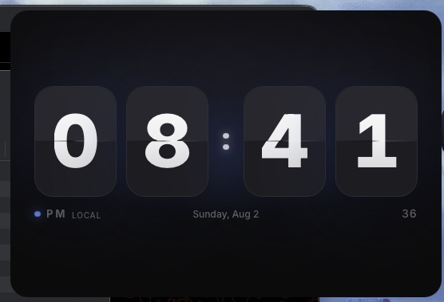
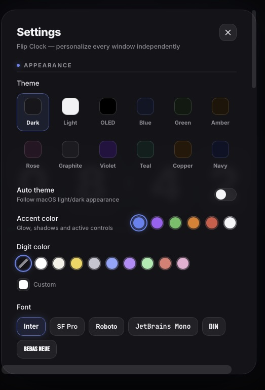
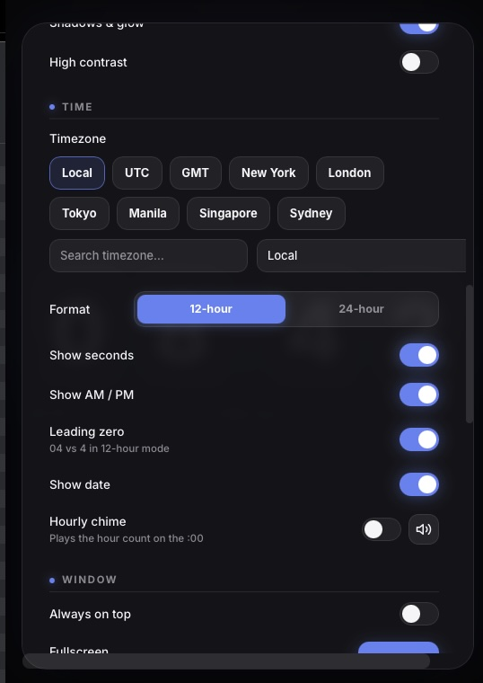

# 🕐 Flip Clock

A beautiful **split-flap flip clock** that floats on your desktop — native on
**macOS** and **Windows**. One clean flip clock per window — open as many
independent windows as you want, each with its own timezone, theme, and settings.
The windows are frameless (no title bar, no browser chrome) on both platforms.

| | |
| --- | --- |
|  |  |
|  | |

Built with React + TypeScript + Vite + **Tauri v2** — a tiny native macOS app
(≈ 2 MB DMG) with a fully custom, glassmorphism UI and buttery CSS-only flip
animations.

---

## ✨ Features

- **Split-flap flip clock** — hours & minutes as animated flip cards, blinking
  colon, small seconds counter, AM/PM, and the date.
- **Multiple independent windows** — one clock per window, unlimited windows.
  Each window has its **own timezone, theme, accent, font, size, position,
  transparency, always-on-top, 12/24-hour format and seconds display**.
- **Session restore** — window positions, sizes and settings are saved;
  relaunching the app recreates your full set of clocks exactly where you left
  them.
- **Duplicate Window** — clone the current window (same timezone, theme, size…)
  and just change its timezone for a second clock.
- **Every IANA timezone** — Local, UTC, GMT, plus search for any zone in the
  world (`Intl.DateTimeFormat`, no external APIs).
- **12 themes** — Dark, Light, OLED, Blue, Green, Amber, Rose, Graphite,
  Violet, Teal, Copper, Navy.
- **6 accent colors**, **custom digit color** (presets + color picker),
  **6 fonts**, and **6 clock faces** (Rounded, Sharp, Retro, Minimal, Glass,
  Neon).
- **Backgrounds** — solid theme, gradients, or your own image; transparency
  40–100%; adjustable corner rounding and shadows.
- **Always on top**, **click-through**, **launch at startup**, **auto-hide UI**,
  **fullscreen**, hourly **chime**, auto light/dark theme, high-contrast mode.
- **Animations** — Enabled / Disabled / Reduced-motion (follows macOS), with a
  speed slider.
- **Fully resizable** — the clock scales smoothly with the window; auto-scale
  keeps it fitting, or resize manually with `+` / `−`.

---

## ⌨️ Keyboard Shortcuts

| Shortcut | Action |
| --- | --- |
| `⌘ N` / `Ctrl+N` | New clock window |
| `⇧ ⌘ N` / `Ctrl+Shift+N` | Duplicate window (clones current window's settings) |
| `⌘ W` / `Ctrl+W` | Close window |
| `F` | Toggle fullscreen |
| `T` | Toggle dark / light theme |
| `S` | Toggle seconds |
| `D` | Toggle date |
| `M` | Toggle 12 / 24 hour |
| `H` | Toggle auto-hide UI |
| `A` | Always on top |
| `+` / `−` | Increase / decrease clock size |
| `R` | Reset window size & position |
| `Esc` | Close settings / exit fullscreen |

> **Menu bar (macOS):** `File → New Clock Window` (`⌘N`), `File → Duplicate
> Window` (`⇧⌘N`), `File → Close Window` (`⌘W`).
> **Windows:** clock windows are frameless, so there's no native menu — use the
> `Ctrl` shortcuts above (WebView2 also supplies `Ctrl+C/V/X/A` in the settings
> fields). Quit with `Alt+F4`, `Ctrl+W` on the last window, or via the taskbar.

---

## 🖱️ Getting Around

- **Drag the window anywhere** to move it — the whole window is a drag region.
- **Settings:** hover the **top-right corner** — a gear button fades in. Click
  it to open the settings panel.

---

## 🌍 Multiple Clocks (per-window timezones)

1. Press **`⌘N`** / **`Ctrl+N`** (or, on macOS, `File → New Clock Window`) for a
   fresh window — or **`⇧⌘N`** / **`Ctrl+Shift+N`** to **duplicate** the current
   one and keep its look.
2. In each window, open **Settings → Time** and pick a timezone (e.g. Manila,
   UTC, New York, Tokyo…).
3. Arrange the windows anywhere on your screen — each is an independent,
   frameless floating clock you can set to *Always on Top*.

Quit with several windows open and relaunch: **Restore Previous Session**
(default on) brings them all back with their settings and positions. Toggle it
in **Settings → Window** if you'd rather start clean.

> Multi-window is a desktop feature. In a plain browser tab, `⌘N` / `Ctrl+N`
> shows a notice that it's available in the desktop build.

---

## ⬇️ Install

### macOS

1. Download the latest **`Flip Clock_<version>_universal.dmg`** from the
   [Releases page](https://github.com/ajcabando/flipclock/releases).
2. Open the DMG and drag **Flip Clock** into your **Applications** folder.

> The app is unsigned (no Apple Developer ID yet), so Gatekeeper may warn on
> first launch. Fix it once: right-click the app → **Open** → **Open**.

### Windows

1. Download the latest **`Flip Clock_<version>_x64-setup.exe`** (NSIS
   installer) — or **`Flip Clock_<version>_x64_en-US.msi`** (MSI installer,
   handy for enterprise/GPO deployment) — from the
   [Releases page](https://github.com/ajcabando/flipclock/releases).
2. Run the installer — it's a standard Windows installer (per-user by
   default), and it will fetch the WebView2 runtime if you don't have it.

> The installer is unsigned, so Windows SmartScreen may show a blue "Windows
> protected your PC" warning. Click **More info → Run anyway** the first time.

> **Windows 11 look:** the frameless window matches Windows 11's native
> styling — ~8px rounded corners and a subtle 1px edge that adapts to the
> theme (light/dark).

### Browser

Run `npm install && npm run dev` and open http://localhost:5173 — everything
works, minus the desktop-only features.

---

## 🛠️ Build from source

```bash
npm install
npm run dev            # live-reload native window (requires Rust + Xcode CLT)
npm run dist:mac       # installable .dmg for your Mac's chip
npm run dist:mac:universal   # universal DMG (Intel + Apple Silicon)
npm run dist:win       # Windows NSIS + MSI installers (run on Windows)
npm run dist:win:nsis  # Windows NSIS installer only
npm run dist:win:msi   # Windows MSI installer only
```

macOS prerequisites: [Rust](https://rustup.rs), Xcode Command Line Tools, and
`create-dmg` (`brew install create-dmg`).

Windows: Tauri can't cross-compile from macOS, so build the Windows installers
on a Windows machine (`npm install && npm run dist:win` — needs Rust with the
MSVC toolchain and WebView2; the MSI target downloads the WiX toolset on
first use). The included GitHub Actions workflow
(`.github/workflows/release.yml`) builds both the NSIS and MSI installers
automatically whenever you push a `v*` tag.

---

## 📦 Changelog

### v1.2.0 — Multi-window redesign

- **One clock per window.** The world-clock dashboard was replaced by native
  multi-window support: every window is an independent, frameless flip clock.
- **Window manager (Rust)** — `File` menu with **New Clock Window** (`⌘N`),
  **Duplicate Window** (`⇧⌘N`), **Close Window** (`⌘W`).
- **Restore Previous Session** — positions, sizes and per-window settings
  survive restarts (default on).
- **Duplicate Window** clones the current window's full setup for fast
  multi-timezone workflows.
- Each window has its own timezone, theme, accent, font, size, transparency,
  always-on-top, 12/24-hour format, and seconds display.
- **Borderless toggle** in Settings → Window (re-enable the title bar if you
  want it).
- **Windows support** — the same frameless, transparent flip clock now runs
  natively on Windows (WebView2): `Ctrl+N` / `Ctrl+Shift+N` / `Ctrl+W`
  shortcuts, platform-aware shortcut hints, and the full feature set
  (multi-window, session restore, always-on-top, chime…).
- **Windows 11 look** — the frameless window matches Windows 11's native
  styling: ~8px rounded corners and a theme-aware 1px edge.
- **Windows installers** — every release now ships an NSIS installer
  (`Flip Clock_<version>_x64-setup.exe`) **and** an MSI installer
  (`Flip Clock_<version>_x64_en-US.msi`), both built by CI on `windows-latest`.

### v1.1.1 — World clock customization

Independent sizing for the world-clock section — size (60–200%), time /
seconds / timezone-label / city-label fonts, per-clock accent & face, and
reordering. *(Replaced by multi-window in v1.2.0.)*

### v1.1.0 — Tauri native app

- **Electron → Tauri v2** — ~100× smaller installer (≈ 2 MB vs 209 MB),
  faster startup, far lower memory.
- **Frameless + clean** — no title bar or top bar, just the floating clock.
- **Drag anywhere + gear button** for Settings.
- **Rounded corners** — 22px rounded frameless transparent window.

---

## 🏗️ Architecture

```
src/
  App.tsx                     — shell: theming, shortcuts, multi-window, chime
  context/SettingsContext.tsx — per-window settings state + persistence
  lib/                        — settings/store, time (Intl), desktop bridge, chime
  hooks/                      — useNow, useAutoHide, useSystemPrefs, useFullscreen
  components/                 — Clock, FlipCard, SecondsCounter, AMPMIndicator,
                                DateDisplay, SettingsPanel, TimezoneSelector, ui
src-tauri/src/lib.rs          — window manager, session persistence, File menu
```

Performance: the tick is aligned to second boundaries, `FlipCard` is memoized
so only changed digits re-render/flip, the settings panel is lazy-loaded, and
all animation is CSS-only for smooth 60 fps flips.
